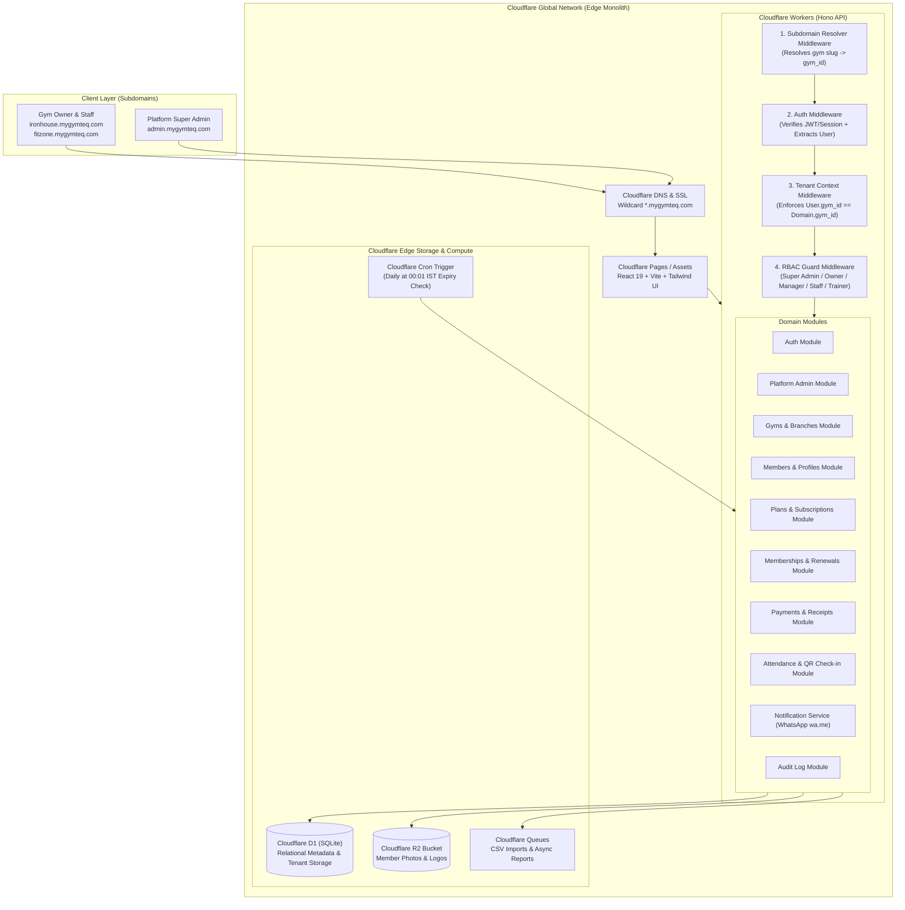
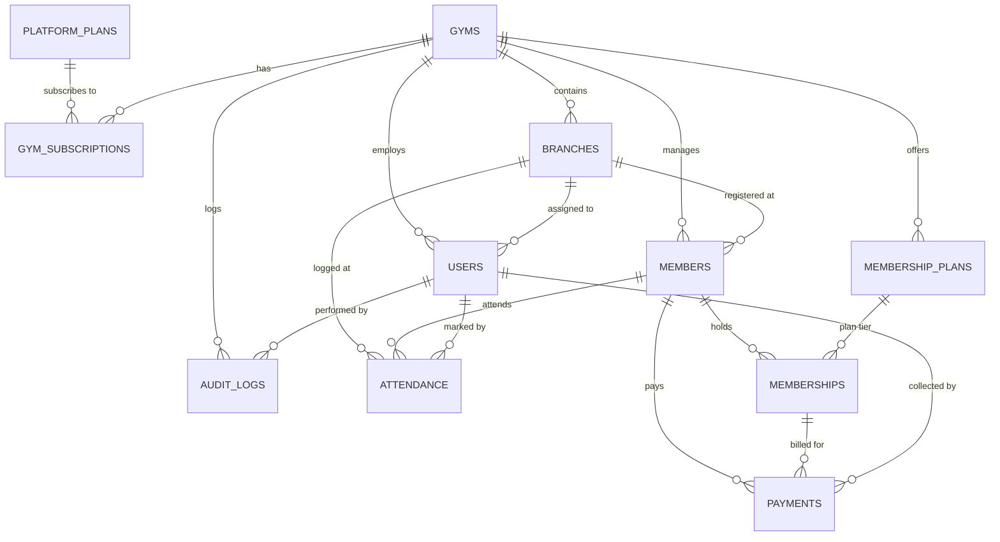

# Multi-Tenant Gym SaaS (India) — Architecture & Execution Implementation Plan

## 1. Executive Architecture Summary

This platform is a **Cloudflare-first, multi-tenant modular monolith** engineered for independent gyms and small gym chains in India. It balances **near-zero initial infrastructure cost** with **enterprise-grade tenant isolation, sub-second latency via Cloudflare edge routing, and clean domain-driven boundaries**.

### Key Architectural Pillars:
- **Unified TypeScript Monorepo**: Turborepo / pnpm workspace unifying `@gym/api` (Cloudflare Workers + Hono), `@gym/web` (React + Vite + Tailwind CSS), and `@gym/shared` (Zod schemas, DTOs, domain models, permissions).
- **Multi-Tenancy Model**: Shared database, shared schema with mandatory `gym_id` and `branch_id` tenant scoping enforced at the middleware, repository, and ORM query level.
- **Edge Data & Storage**: Cloudflare D1 (SQLite at the edge) for transactional metadata; Cloudflare R2 for member photos and gym branding; Cloudflare Queues for asynchronous background tasks (CSV parsing, batch analytics); Cloudflare Cron Triggers for daily automated membership status transitions and renewal alerts.
- **Cost-Optimized Pilot Engine**: No recurring SMS/WhatsApp API fees initially; utilizes zero-cost **Click-to-WhatsApp (wa.me)** automation with a pluggable provider interface (`NotificationService`) ready for MSG91 / Gupshup / Fast2SMS when revenue warrants it.

---

## 2. Architecture Diagram



---

## 3. Repository Structure (Monorepo Layout)

We will use a pnpm / Turborepo workspace to guarantee 100% type sharing between frontend and backend without publishing separate packages:

```
mygymteq/
├── .github/
│   └── workflows/
│       ├── ci.yml                 # Lint, Typecheck, Unit & Tenant Isolation Tests
│       └── deploy.yml             # Wrangler deployments to Dev, Staging, Prod
├── apps/
│   ├── api/                       # Cloudflare Workers + Hono Backend
│   │   ├── src/
│   │   │   ├── db/
│   │   │   │   ├── migrations/    # D1 SQL migration files (0001_init.sql, etc.)
│   │   │   │   ├── schema.ts      # Drizzle ORM SQLite Schema definitions
│   │   │   │   └── client.ts      # D1 Drizzle client initialization
│   │   │   ├── middleware/
│   │   │   │   ├── auth.middleware.ts       # JWT verification & session loader
│   │   │   │   ├── tenant.middleware.ts     # Gym resolution & tenant barrier
│   │   │   │   ├── rbac.middleware.ts       # Role & permission authorization
│   │   │   │   ├── subdomain.middleware.ts  # Hostname parser (slug -> gym_id)
│   │   │   │   └── error.middleware.ts      # Centralized error handler & logger
│   │   │   ├── modules/
│   │   │   │   ├── auth/          # routes, services, repositories
│   │   │   │   ├── platform/      # super admin gym/plan/subscription management
│   │   │   │   ├── gyms/          # gym settings, branches, metadata
│   │   │   │   ├── members/       # member profiles, search, photo uploads
│   │   │   │   ├── memberships/   # member plans, assignments, renewal logic
│   │   │   │   ├── payments/      # manual payment logging (Cash/UPI/Card), balance
│   │   │   │   ├── attendance/    # manual check-in, QR token generation & verify
│   │   │   │   ├── dashboard/     # owner & platform metric aggregations
│   │   │   │   ├── notifications/ # Click-to-WhatsApp link generator & abstractions
│   │   │   │   └── audit/         # immutable audit logging service
│   │   │   ├── queues/            # Queue consumers (CSV import, background tasks)
│   │   │   ├── cron/              # Scheduled worker handlers (midnight expiry jobs)
│   │   │   ├── env.ts             # Cloudflare Env interface bindings
│   │   │   └── index.ts           # Hono app root & route registration
│   │   ├── test/                  # Vitest + Miniflare integration & tenant tests
│   │   ├── wrangler.jsonc         # Cloudflare Worker configuration & D1/R2/Queue bindings
│   │   ├── tsconfig.json
│   │   └── package.json
│   │
│   └── web/                       # React 19 + Vite + Tailwind CSS Single Page App
│       ├── src/
│       │   ├── api/               # Typed API client using shared types
│       │   ├── assets/            # Static brand assets and SVGs
│       │   ├── components/        # Reusable UI primitives (Buttons, Tables, Modals, Forms)
│       │   │   ├── ui/
│       │   │   ├── layout/        # AppShell, Sidebar, Header, Breadcrumbs
│       │   │   └── feedback/     # Toasts, ConfirmDialogs, LoadingSkeleton
│       │   ├── context/           # AuthContext, TenantContext, BranchContext
│       │   ├── hooks/             # Custom hooks (useAuth, useTenant, usePermissions)
│       │   ├── routes/            # React Router v6/v7 route definitions
│       │   │   ├── platform/      # /admin routes (Super Admin views)
│       │   │   ├── tenant/        # /dashboard, /members, /memberships, /payments, etc.
│       │   │   └── auth/          # /login, /forgot-password, /onboarding
│       │   ├── utils/             # Formatters (INR currency format, IST date format)
│       │   ├── App.tsx
│       │   └── main.tsx
│       ├── index.html
│       ├── vite.config.ts
│       ├── tailwind.config.ts
│       └── package.json
│
├── packages/
│   ├── shared/                    # Shared DTOs, Enums, Zod Validation Schemas
│   │   ├── src/
│   │   │   ├── types/             # User, Gym, Member, Membership, Payment types
│   │   │   ├── permissions/       # RBAC roles, permission flags & matrix
│   │   │   ├── validation/        # Zod schemas for all API payloads
│   │   │   └── index.ts
│   │   ├── tsconfig.json
│   │   └── package.json
│   └── tsconfig/                  # Shared base tsconfig files
├── package.json                   # Root package.json with pnpm workspaces
├── pnpm-workspace.yaml
├── turbo.json                     # Turborepo build pipeline
└── README.md
```

---

## 4. Database ERD & Schema Proposal (Cloudflare D1 / SQLite)



### Complete D1 SQLite DDL Specifications:

```sql
-- 1. SaaS Platform Subscription Plans (SaaS pricing for gym owners)
CREATE TABLE platform_plans (
    id TEXT PRIMARY KEY,                       -- e.g. 'plan_basic', 'plan_pro'
    name TEXT NOT NULL,                        -- 'Starter', 'Growth', 'Chain Enterprise'
    slug TEXT NOT NULL UNIQUE,
    monthly_price_inr INTEGER NOT NULL,        -- In Paise (e.g. 99900 = ₹999/mo)
    yearly_price_inr INTEGER NOT NULL,         -- In Paise
    max_members INTEGER NOT NULL DEFAULT 150,  -- Plan limit
    max_branches INTEGER NOT NULL DEFAULT 1,
    max_staff INTEGER NOT NULL DEFAULT 3,
    has_qr_attendance INTEGER NOT NULL DEFAULT 1,
    has_reports INTEGER NOT NULL DEFAULT 0,
    has_whatsapp_automation INTEGER NOT NULL DEFAULT 0,
    is_active INTEGER NOT NULL DEFAULT 1,
    created_at TEXT NOT NULL DEFAULT (datetime('now')),
    updated_at TEXT NOT NULL DEFAULT (datetime('now'))
);

-- 2. Gyms (Tenants)
CREATE TABLE gyms (
    id TEXT PRIMARY KEY,                       -- UUIDv7
    name TEXT NOT NULL,                        -- 'Iron House Gym'
    slug TEXT NOT NULL UNIQUE,                 -- 'ironhouse' (used in ironhouse.mygymteq.com)
    custom_domain TEXT UNIQUE,                 -- Optional custom domain: 'members.ironhouse.in'
    logo_r2_key TEXT,                          -- Cloudflare R2 path
    phone TEXT NOT NULL,
    email TEXT,
    address TEXT,
    city TEXT NOT NULL,
    state TEXT NOT NULL DEFAULT 'Telangana',
    pincode TEXT,
    gstin TEXT,                                -- GST Number for Indian invoices
    status TEXT NOT NULL DEFAULT 'TRIAL',      -- 'TRIAL', 'ACTIVE', 'PAST_DUE', 'SUSPENDED'
    created_at TEXT NOT NULL DEFAULT (datetime('now')),
    updated_at TEXT NOT NULL DEFAULT (datetime('now')),
    deleted_at TEXT
);
CREATE INDEX idx_gyms_slug ON gyms(slug);
CREATE INDEX idx_gyms_status ON gyms(status);

-- 3. Gym Subscriptions & Entitlements
CREATE TABLE gym_subscriptions (
    id TEXT PRIMARY KEY,
    gym_id TEXT NOT NULL,
    plan_id TEXT NOT NULL,
    status TEXT NOT NULL DEFAULT 'TRIAL',      -- 'TRIAL', 'ACTIVE', 'CANCELLED', 'EXPIRED'
    trial_ends_at TEXT,
    current_period_start TEXT NOT NULL,
    current_period_end TEXT NOT NULL,
    max_members_override INTEGER,              -- Custom override beyond plan default
    max_branches_override INTEGER,
    created_at TEXT NOT NULL DEFAULT (datetime('now')),
    updated_at TEXT NOT NULL DEFAULT (datetime('now')),
    FOREIGN KEY (gym_id) REFERENCES gyms(id) ON DELETE CASCADE,
    FOREIGN KEY (plan_id) REFERENCES platform_plans(id)
);
CREATE INDEX idx_gym_subscriptions_gym ON gym_subscriptions(gym_id);

-- 4. Branches (Multi-Branch support for gyms)
CREATE TABLE branches (
    id TEXT PRIMARY KEY,
    gym_id TEXT NOT NULL,
    name TEXT NOT NULL,                        -- 'Main Branch - Jubilee Hills'
    code TEXT NOT NULL,                        -- 'JH-01'
    phone TEXT,
    address TEXT,
    is_primary INTEGER NOT NULL DEFAULT 0,
    is_active INTEGER NOT NULL DEFAULT 1,
    created_at TEXT NOT NULL DEFAULT (datetime('now')),
    updated_at TEXT NOT NULL DEFAULT (datetime('now')),
    deleted_at TEXT,
    FOREIGN KEY (gym_id) REFERENCES gyms(id) ON DELETE CASCADE,
    UNIQUE(gym_id, code)
);
CREATE INDEX idx_branches_gym ON branches(gym_id);

-- 5. Unified Users & Identity (Platform Super Admin, Gym Owners, Staff, Trainers)
CREATE TABLE users (
    id TEXT PRIMARY KEY,
    gym_id TEXT,                               -- NULL for Super Admins
    branch_id TEXT,                            -- NULL for Super Admins / Multi-branch Owners
    email TEXT NOT NULL,
    phone TEXT NOT NULL,
    password_hash TEXT NOT NULL,               -- Argon2id / WebCrypto scrypt / bcrypt
    full_name TEXT NOT NULL,
    role TEXT NOT NULL,                        -- 'SUPER_ADMIN', 'GYM_OWNER', 'MANAGER', 'STAFF', 'TRAINER'
    is_active INTEGER NOT NULL DEFAULT 1,
    last_login_at TEXT,
    created_at TEXT NOT NULL DEFAULT (datetime('now')),
    updated_at TEXT NOT NULL DEFAULT (datetime('now')),
    deleted_at TEXT,
    FOREIGN KEY (gym_id) REFERENCES gyms(id) ON DELETE CASCADE,
    FOREIGN KEY (branch_id) REFERENCES branches(id) ON DELETE SET NULL,
    UNIQUE(email)
);
CREATE INDEX idx_users_gym_role ON users(gym_id, role);
CREATE INDEX idx_users_phone ON users(phone);

-- 6. Members
CREATE TABLE members (
    id TEXT PRIMARY KEY,
    gym_id TEXT NOT NULL,
    branch_id TEXT NOT NULL,
    member_code TEXT NOT NULL,                 -- e.g. 'MEM-1001' (Gym-specific auto-increment sequence)
    full_name TEXT NOT NULL,
    phone TEXT NOT NULL,
    email TEXT,
    gender TEXT CHECK(gender IN ('MALE', 'FEMALE', 'OTHER')),
    dob TEXT,                                  -- 'YYYY-MM-DD'
    photo_r2_key TEXT,                         -- Cloudflare R2 object key
    emergency_contact_name TEXT,
    emergency_contact_phone TEXT,
    medical_notes TEXT,
    address TEXT,
    joining_date TEXT NOT NULL,                -- 'YYYY-MM-DD'
    status TEXT NOT NULL DEFAULT 'ACTIVE',     -- 'ACTIVE', 'EXPIRED', 'FROZEN', 'INACTIVE'
    created_at TEXT NOT NULL DEFAULT (datetime('now')),
    updated_at TEXT NOT NULL DEFAULT (datetime('now')),
    deleted_at TEXT,
    FOREIGN KEY (gym_id) REFERENCES gyms(id) ON DELETE CASCADE,
    FOREIGN KEY (branch_id) REFERENCES branches(id),
    UNIQUE(gym_id, member_code)
);
CREATE INDEX idx_members_gym_status ON members(gym_id, status);
CREATE INDEX idx_members_gym_phone ON members(gym_id, phone);
CREATE INDEX idx_members_branch ON members(branch_id);

-- 7. Gym's Membership Plans (Offered by gym to their members)
CREATE TABLE membership_plans (
    id TEXT PRIMARY KEY,
    gym_id TEXT NOT NULL,
    name TEXT NOT NULL,                        -- 'Monthly Gym', 'Quarterly Cardio + Weights', 'Annual VIP'
    duration_months INTEGER NOT NULL,          -- 1, 3, 6, 12
    duration_days INTEGER NOT NULL DEFAULT 0,  -- e.g. Extra grace days or short-term trials
    price_inr INTEGER NOT NULL,                -- Base price in Paise
    admission_fee_inr INTEGER NOT NULL DEFAULT 0,
    description TEXT,
    is_active INTEGER NOT NULL DEFAULT 1,
    created_at TEXT NOT NULL DEFAULT (datetime('now')),
    updated_at TEXT NOT NULL DEFAULT (datetime('now')),
    deleted_at TEXT,
    FOREIGN KEY (gym_id) REFERENCES gyms(id) ON DELETE CASCADE
);
CREATE INDEX idx_membership_plans_gym ON membership_plans(gym_id);

-- 8. Member Assigned Memberships (Lifecycle: Active -> Expiring -> Expired -> Renewed)
CREATE TABLE memberships (
    id TEXT PRIMARY KEY,
    gym_id TEXT NOT NULL,
    member_id TEXT NOT NULL,
    plan_id TEXT NOT NULL,
    start_date TEXT NOT NULL,                  -- 'YYYY-MM-DD'
    end_date TEXT NOT NULL,                    -- 'YYYY-MM-DD' (Auto-calculated)
    total_amount_inr INTEGER NOT NULL,         -- In Paise (Agreed price after discount)
    discount_inr INTEGER NOT NULL DEFAULT 0,
    paid_amount_inr INTEGER NOT NULL DEFAULT 0,-- Computed & updated on payments
    status TEXT NOT NULL DEFAULT 'ACTIVE',     -- 'ACTIVE', 'EXPIRED', 'CANCELLED', 'FROZEN'
    notes TEXT,
    created_by_user_id TEXT,
    created_at TEXT NOT NULL DEFAULT (datetime('now')),
    updated_at TEXT NOT NULL DEFAULT (datetime('now')),
    FOREIGN KEY (gym_id) REFERENCES gyms(id) ON DELETE CASCADE,
    FOREIGN KEY (member_id) REFERENCES members(id) ON DELETE CASCADE,
    FOREIGN KEY (plan_id) REFERENCES membership_plans(id),
    FOREIGN KEY (created_by_user_id) REFERENCES users(id)
);
CREATE INDEX idx_memberships_gym_dates ON memberships(gym_id, end_date);
CREATE INDEX idx_memberships_member ON memberships(member_id);
CREATE INDEX idx_memberships_status ON memberships(gym_id, status);

-- 9. Payments
CREATE TABLE payments (
    id TEXT PRIMARY KEY,
    gym_id TEXT NOT NULL,
    branch_id TEXT NOT NULL,
    member_id TEXT NOT NULL,
    membership_id TEXT,                        -- Can be NULL for standalone fees
    receipt_number TEXT NOT NULL,              -- 'REC-2026-0001' (Gym-specific)
    amount_inr INTEGER NOT NULL,               -- In Paise (e.g. 350000 = ₹3500)
    payment_method TEXT NOT NULL,              -- 'CASH', 'UPI', 'CARD', 'NETBANKING', 'OTHER'
    payment_date TEXT NOT NULL,                -- 'YYYY-MM-DD'
    upi_ref_or_txn_id TEXT,                    -- UTR / Transaction reference
    collected_by_user_id TEXT NOT NULL,
    notes TEXT,
    created_at TEXT NOT NULL DEFAULT (datetime('now')),
    FOREIGN KEY (gym_id) REFERENCES gyms(id) ON DELETE CASCADE,
    FOREIGN KEY (branch_id) REFERENCES branches(id),
    FOREIGN KEY (member_id) REFERENCES members(id) ON DELETE CASCADE,
    FOREIGN KEY (membership_id) REFERENCES memberships(id),
    FOREIGN KEY (collected_by_user_id) REFERENCES users(id),
    UNIQUE(gym_id, receipt_number)
);
CREATE INDEX idx_payments_gym_date ON payments(gym_id, payment_date);
CREATE INDEX idx_payments_member ON payments(member_id);
CREATE INDEX idx_payments_membership ON payments(membership_id);

-- 10. Attendance Logs
CREATE TABLE attendance (
    id TEXT PRIMARY KEY,
    gym_id TEXT NOT NULL,
    branch_id TEXT NOT NULL,
    member_id TEXT NOT NULL,
    check_in_time TEXT NOT NULL DEFAULT (datetime('now')), -- UTC ISO String
    check_out_time TEXT,
    check_in_method TEXT NOT NULL DEFAULT 'MANUAL',        -- 'MANUAL', 'QR_SCAN', 'BIOMETRIC'
    marked_by_user_id TEXT,                                -- NULL if QR self-scan
    FOREIGN KEY (gym_id) REFERENCES gyms(id) ON DELETE CASCADE,
    FOREIGN KEY (branch_id) REFERENCES branches(id),
    FOREIGN KEY (member_id) REFERENCES members(id) ON DELETE CASCADE,
    FOREIGN KEY (marked_by_user_id) REFERENCES users(id)
);
CREATE INDEX idx_attendance_gym_date ON attendance(gym_id, check_in_time);
CREATE INDEX idx_attendance_member_date ON attendance(member_id, check_in_time);

-- 11. Immutable Audit Logs
CREATE TABLE audit_logs (
    id TEXT PRIMARY KEY,
    gym_id TEXT,                               -- NULL for Platform Admin actions
    user_id TEXT,
    action TEXT NOT NULL,                      -- 'MEMBER_CREATED', 'PAYMENT_RECORDED', 'PLAN_CHANGED', etc.
    entity_type TEXT NOT NULL,                 -- 'MEMBER', 'MEMBERSHIP', 'PAYMENT', 'GYM'
    entity_id TEXT NOT NULL,
    old_state TEXT,                            -- JSON string
    new_state TEXT,                            -- JSON string
    ip_address TEXT,
    user_agent TEXT,
    created_at TEXT NOT NULL DEFAULT (datetime('now')),
    FOREIGN KEY (gym_id) REFERENCES gyms(id) ON DELETE CASCADE,
    FOREIGN KEY (user_id) REFERENCES users(id)
);
CREATE INDEX idx_audit_gym_action ON audit_logs(gym_id, action, created_at);
```

---

## 5. Authentication, RBAC & Multi-Tenancy Architecture

### 5.1 Identity & Context Extraction
1. **Central User Model**: All users authenticate against the same table.
2. **Subdomain + Host Routing**:
   - Host `admin.mygymteq.com` $\rightarrow$ Platform Super Admin workspace.
   - Host `{slug}.mygymteq.com` or custom domain $\rightarrow$ Resolved to `gym_id`.
3. **Session / JWT Structure**:
   ```typescript
   export interface AuthTokenPayload {
     sub: string;             // user_id
     gymId: string | null;    // gym_id (null if Super Admin)
     branchId: string | null; // branch_id
     role: Role;              // 'SUPER_ADMIN' | 'GYM_OWNER' | 'MANAGER' | 'STAFF' | 'TRAINER'
     exp: number;
   }
   ```
4. **Tenant Barrier Validation (`tenant.middleware.ts`)**:
   - For any tenant-scoped request (`{slug}.mygymteq.com/api/*`):
     1. Resolve `slug` to target `gym_id`.
     2. Ensure `gym.status !== 'SUSPENDED'`.
     3. Verify `authPayload.role === 'SUPER_ADMIN' || authPayload.gymId === gym.id`.
     4. If mismatched $\rightarrow$ Immediate `403 Forbidden` with audit log trigger.
   - Context is injected into Hono Context: `c.set('tenant', { gymId, branchId, user })`.

### 5.2 Role & Permissions Matrix

| Permission Key | SUPER_ADMIN | GYM_OWNER | MANAGER | STAFF | TRAINER |
| :--- | :---: | :---: | :---: | :---: | :---: |
| `platform:manage_gyms` | ✅ | ❌ | ❌ | ❌ | ❌ |
| `platform:manage_plans` | ✅ | ❌ | ❌ | ❌ | ❌ |
| `gym:manage_settings` | ✅ | ✅ | ❌ | ❌ | ❌ |
| `gym:manage_branches` | ✅ | ✅ | ❌ | ❌ | ❌ |
| `gym:manage_staff` | ✅ | ✅ | ✅ (View/Edit) | ❌ | ❌ |
| `member:create_edit` | ✅ | ✅ | ✅ | ✅ | ❌ (View only) |
| `member:delete` | ✅ | ✅ | ❌ | ❌ | ❌ |
| `membership:assign` | ✅ | ✅ | ✅ | ✅ | ❌ |
| `payment:record` | ✅ | ✅ | ✅ | ✅ | ❌ |
| `payment:delete_edit` | ✅ | ✅ | ❌ | ❌ | ❌ |
| `attendance:mark` | ✅ | ✅ | ✅ | ✅ | ✅ |
| `reports:view_revenue` | ✅ | ✅ | ✅ | ❌ | ❌ |

---

## 6. Subdomain & Domain Architecture

1. **DNS Setup**: Wildcard DNS `*.mygymteq.com` pointing to the Cloudflare Worker / Pages deployment.
2. **Resolution Algorithm**:
   - Host `admin.mygymteq.com` or `localhost:5173/admin` $\rightarrow$ Platform Mode.
   - Host `ironhouse.mygymteq.com` $\rightarrow$ Slug is `ironhouse`. Query D1 for `gyms.slug = 'ironhouse'`.
   - Custom domain `members.ironhouse.in` $\rightarrow$ Cloudflare for SaaS (Custom Hostnames) lookup on `gyms.custom_domain`.
3. **Frontend Subdomain Awareness**:
   - The React frontend inspects `window.location.hostname`.
   - If on gym subdomain, sets tenant context and theme branding (logo, colors).
   - If on `admin.mygymteq.com`, renders Super Admin Shell.

---

## 7. Click-to-WhatsApp Notification Engine (Zero-Cost MVP)

Instead of paid Twilio/Gupshup SMS fees, the MVP uses a clean **Click-to-WhatsApp link generator**:

```typescript
// Shared WhatsApp Template Generator
export function generateWhatsAppLink(phone: string, template: 'NEW_MEMBER' | 'PAYMENT_RECEIPT' | 'RENEWAL_REMINDER', data: Record<string, string>) {
  // Format Indian phone numbers (+91)
  const cleanPhone = phone.replace(/\D/g, '').slice(-10);
  const fullPhone = `91${cleanPhone}`;
  
  let message = '';
  if (template === 'NEW_MEMBER') {
    message = `Welcome to *${data.gymName}*, ${data.memberName}! 💪\nYour Member ID is *${data.memberCode}*. Your membership starts on ${data.startDate}.\nLet's crush your fitness goals!`;
  } else if (template === 'PAYMENT_RECEIPT') {
    message = `Hi ${data.memberName}, we have received your payment of *₹${data.amount}* for *${data.gymName}* (Receipt: ${data.receiptNumber}). Thank you! 🙏`;
  } else if (template === 'RENEWAL_REMINDER') {
    message = `Hi ${data.memberName}, your membership at *${data.gymName}* is expiring on *${data.expiryDate}*. Renew today to avoid interruption in your workouts! 🏋️`;
  }
  
  return `https://wa.me/${fullPhone}?text=${encodeURIComponent(message)}`;
}
```

---

## 8. API Endpoint Specification (Hono API)

### Platform Super Admin (`/api/platform/*`)
- `GET /api/platform/metrics` — Aggregate platform stats (Total Gyms, Active, Trial, MRR)
- `GET /api/platform/gyms` — List gyms with pagination, status, and subscription details
- `POST /api/platform/gyms` — Create new gym tenant + initial owner account
- `GET /api/platform/gyms/:id` — Gym deep dive (branches, usage, audit logs)
- `PATCH /api/platform/gyms/:id/status` — Suspend / Reactivate gym
- `POST /api/platform/gyms/:id/subscription` — Upgrade/downgrade plan or extend trial
- `GET /api/platform/plans` & `POST /api/platform/plans` — Manage SaaS subscription plans

### Tenant Auth & User Operations (`/api/auth/*`)
- `POST /api/auth/login` — Centralized email + password login (returns JWT + gym info)
- `GET /api/auth/me` — Current authenticated user profile, permissions & gym context
- `POST /api/auth/forgot-password` / `POST /api/auth/reset-password`

### Gym Administration & Branches (`/api/gym/*`)
- `GET /api/gym/settings` & `PUT /api/gym/settings` — Update gym name, logo, phone, GSTIN
- `GET /api/gym/branches` & `POST /api/gym/branches` — Branch list & creation
- `GET /api/gym/staff` & `POST /api/gym/staff` — Staff/Trainer invitation and role assignments

### Members & Profiles (`/api/members/*`)
- `GET /api/members` — Paginated member search (filter by status, branch, search query)
- `POST /api/members` — Create member (auto-generates member code, validates limits)
- `GET /api/members/:id` — Member 360° profile (memberships, payment history, attendance)
- `PUT /api/members/:id` — Update member information
- `POST /api/members/:id/photo` — Presigned R2 upload URL generation
- `POST /api/members/import-csv` — Bulk CSV upload dispatcher (Queue worker)

### Membership Plans & Member Subscriptions (`/api/memberships/*`)
- `GET /api/membership-plans` & `POST /api/membership-plans` — Gym-defined membership tiers
- `POST /api/memberships/assign` — Assign plan to member (computes end date, creates invoice/membership)
- `POST /api/memberships/:id/renew` — Renew membership with automated previous-date roll
- `GET /api/memberships/expiring` — Filter expiring memberships (next 3, 7, 15 days)

### Payments (`/api/payments/*`)
- `GET /api/payments` — Payment transaction ledger
- `POST /api/payments` — Record payment (Cash / UPI / Card / NetBanking)
- `GET /api/payments/:id/receipt` — Printable receipt data & WhatsApp message payload
- `GET /api/payments/dues` — Members with outstanding unpaid balances

### Attendance (`/api/attendance/*`)
- `GET /api/attendance/today` — Real-time attendance roster for current date
- `POST /api/attendance/check-in` — Manual check-in by staff
- `POST /api/attendance/qr-token` — Generate dynamic branch check-in QR code
- `POST /api/attendance/scan` — Member self-scan check-in

### Analytics & Dashboard (`/api/dashboard/*`)
- `GET /api/dashboard/summary` — Active members, Expiring this week, Today's attendance, Month revenue, Pending dues

---

## 9. Critical Architectural Challenges & Senior Review

### 1. D1 SQLite Concurrency & Sequence Generation
- **Challenge**: D1 runs on SQLite. Generating sequential receipt numbers (`REC-2026-0001`) or member codes (`MEM-1001`) with naive `SELECT COUNT(*)` can create race conditions under concurrent check-ins/payments.
- **Solution**: Use atomic transactions (`db.batch()`) or deterministic UUIDv7 with formatted display numbers generated inside single atomic statement increments per tenant.

### 2. Timezone Normalization (IST UTC+05:30 vs Edge UTC)
- **Challenge**: Cloudflare Workers execute in UTC globally. Indian gyms calculate "Today's Attendance" and "Expiring on 2026-08-26" in Indian Standard Time (IST, UTC+05:30).
- **Solution**: Store all timestamps in UTC ISO strings (`datetime('now')`), but store business calendar dates as explicit `YYYY-MM-DD` strings calculated in `Asia/Kolkata` time. Cron jobs will trigger at `18:31 UTC` which is `00:01 IST`.

### 3. ORM & Query Layer Decision (Drizzle ORM for D1)
- **Evaluation**: Drizzle ORM provides zero-overhead TypeScript schema generation, lightweight SQL compilation, zero native binary dependencies (runs smoothly on Workers V8 isolates), and first-class Cloudflare D1 support with batching.
- **Decision**: Standardize on **Drizzle ORM for D1** with strict tenant ID query helper wrappers.

### 4. JWT Stateless Auth vs D1 Sessions
- **Decision**: Use lightweight signed JWTs (Web Crypto HMAC-SHA256) with short expiry (12 hours) containing user identity, gym ID, and role. Revocation/suspension is verified at the edge by checking `gym.status` cached via Cloudflare Workers KV / fast D1 read.

---

## 10. Cost Model & Cloudflare Free Tier Economics

| Cloudflare Component | Free Tier Allowance | Initial Pilot Cost (1-5 Gyms) |
| :--- | :--- | :--- |
| **Workers** | 100,000 requests / day | ₹0 / $0 |
| **Cloudflare Pages (UI)** | Unlimited bandwidth / requests | ₹0 / $0 |
| **D1 (Database)** | 5M read rows/day, 100k write rows/day | ₹0 / $0 |
| **R2 (Object Storage)** | 10 GB storage / month, 1M Class A ops | ₹0 / $0 |
| **Queues & Cron** | Included in standard free/Workers plan | ₹0 / $0 |
| **SMS / WhatsApp Gateway** | Deliberately using **wa.me direct URL** | ₹0 / $0 |
| **Total Estimated Initial Cost** | — | **₹0 / month** |

---

## 11. MVP Phased Execution Roadmap

### Phase 0: Workspace Setup & Foundational Framework
- [ ] Initialize pnpm monorepo with Turborepo (`apps/api`, `apps/web`, `packages/shared`).
- [ ] Configure Tailwind CSS, Vite, and Hono worker entry point.
- [ ] Set up Drizzle ORM schema and initial D1 SQL migration.
- [ ] Configure `wrangler.jsonc` with D1, R2, and Queue bindings.

### Phase 1: Identity, Multi-Tenancy & Platform Super Admin
- [ ] Implement Auth module (password hashing, JWT issuance, `/api/auth/login`).
- [ ] Build Subdomain, Tenant, and RBAC Hono middlewares.
- [ ] Build Super Admin Dashboard UI (Gym management, Plan assignment, Subscription lifecycle).
- [ ] Automated Cross-Tenant Security Test Suite (`test/tenant-isolation.spec.ts`).

### Phase 2: Gym Onboarding, Settings & Member Management
- [ ] Gym settings (Branding, Logo upload to R2, Branches).
- [ ] Member CRUD (Search, Filters, Photo capture/upload, Details view).
- [ ] Click-to-WhatsApp link integration for welcoming new members.

### Phase 3: Membership Plans, Assigning & Lifecycle Engine
- [ ] Gym membership plan catalog (Monthly, Quarterly, Annual).
- [ ] Assigning memberships to members (Date range calculation, dues tracking).
- [ ] Scheduled Worker (Midnight IST) for auto-expiring memberships.
- [ ] Renewal workflow and upcoming expiry notifications (Click-to-WhatsApp).

### Phase 4: Payment Ledger & Receipts
- [ ] Record payment (Cash, UPI with UTR reference, Card).
- [ ] Auto-calculate outstanding dues on member profile.
- [ ] Digital receipt view & instant WhatsApp receipt link generator.

### Phase 5: Attendance & QR Check-in System
- [ ] Staff manual check-in interface with rapid member search.
- [ ] Daily attendance dashboard & streak tracker.
- [ ] QR Code generator for front-desk check-in.

### Phase 6: Gym Owner Dashboard & Metric Analytics
- [ ] High-impact KPI cards: Active Members, Today's Attendance, Monthly Revenue, Unpaid Dues, Expiring Memberships.
- [ ] Quick Action shortcuts (New Member, Record Payment, Mark Attendance).

---

## 12. Verification & Automated Testing Plan

### Automated Test Suite (`apps/api/test`)
1. **Tenant Isolation Unit & Integration Tests**:
   - `test/tenant-isolation.spec.ts`: Seed Gym A and Gym B. Ensure Gym A user token querying Gym B endpoints returns `403 Forbidden` and zero leaked rows.
2. **Membership Expiry Calculation Tests**:
   - `test/membership-calculator.spec.ts`: Verify accurate duration and leap-year calculations in IST.
3. **Payment Due Balance Tests**:
   - `test/payment-dues.spec.ts`: Validate that partial payments correctly update `paid_amount_inr` and compute outstanding balance.

### Manual End-to-End Verification
1. Log in as Super Admin $\rightarrow$ Create Gym "Iron House" (`ironhouse`) and Owner account.
2. Navigate to `ironhouse.localhost:5173` $\rightarrow$ Log in as Gym Owner.
3. Create Membership Plan $\rightarrow$ Add Member $\rightarrow$ Assign Plan $\rightarrow$ Record UPI Payment $\rightarrow$ Verify Click-to-WhatsApp receipt link.
4. Mark Attendance $\rightarrow$ View Real-time Dashboard KPIs.

---

## 13. Open Questions & Product Decisions

> [!IMPORTANT]
> **Key Decisions for Confirmation:**
> 1. **Default Currency & Localization**: Base currency is configured in **INR (₹) with Paise integer precision** (e.g. ₹1,500 stored as 150000).
> 2. **Authentication Method**: Standard Email + Password with Argon2id/WebCrypto hashes. (Optional future OTP login via WhatsApp when communication provider is added).
> 3. **QR Check-in Flow**: Initial QR will be a static/rotating front-desk QR that members can scan with their phone camera to open their member portal check-in link.
