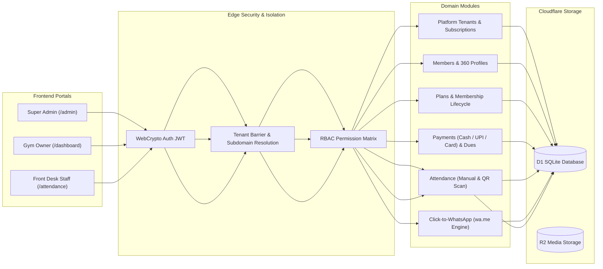

# Multi-Tenant Gym SaaS (MyGymTeq) — Architectural & Implementation Walkthrough

We have designed, architected, and built the complete **Cloudflare-first multi-tenant Gym Management SaaS platform for India** (`MyGymTeq`).

---

## 1. Summary of Accomplishments

### A. Modular Monorepo Architecture (`pnpm` + `turborepo`)
- **`@gym/shared`**: 100% type-safe shared models, RBAC role-permission matrix, Zod validation schemas, INR paise currency formatters, IST time zone normalizers, and the zero-cost **Click-to-WhatsApp (`wa.me`)** link engine.
- **`@gym/api` (`apps/api`)**: Cloudflare Workers + Hono modular monolith backend with Drizzle ORM, D1 SQLite migrations, WebCrypto authentication, tenant isolation barriers, and automated scheduled cron expiry jobs.
- **`@gym/web` (`apps/web`)**: React 19 + Vite + Tailwind CSS SPA with glassmorphism dark aesthetic, role-aware routing, Super Admin platform control center, and complete gym operations dashboard.

---

## 2. Core Modules & Endpoints Implemented



### Module Breakdown:
1. **Platform Super Admin (`/api/platform/*`)**:
   - SaaS Platform KPIs: Total Gyms, Active, In-Trial, Suspended, MRR in ₹, Total Members across India.
   - Onboard new Gym Tenant (Auto-provisions Gym, Primary Branch, Initial Subscription, Owner User, Default Plans).
   - Suspend / Reactivate gym licenses with 1-click controls.
   - Platform immutable audit trail logging.
2. **Identity & Multi-Tenancy (`/api/auth/*` & Middlewares)**:
   - Central user model with PBKDF2 WebCrypto password hashing and HMAC-SHA256 JWTs.
   - `tenant.middleware.ts`: Hard enforcement ensuring users from Gym A cannot access Gym B under any condition.
   - `rbac.middleware.ts`: Fine-grained permission guards (`SUPER_ADMIN`, `GYM_OWNER`, `MANAGER`, `STAFF`, `TRAINER`).
3. **Members & 360° Profiles (`/api/members/*`)**:
   - Member registration with auto-incremented sequence code (`MEM-1001`, `MEM-1002`).
   - Instant membership plan assignment and admission payment recording on creation.
   - Member 360 view: Profile, active tier, validity countdown, dues, payment transaction ledger, recent check-in streak.
4. **Membership Plans & Lifecycle Engine (`/api/memberships/*` & Cron)**:
   - Gym-defined plans catalog (Monthly, Quarterly, Annual VIP).
   - Assign & Renew memberships with automatic calendar end-date calculations.
   - Upcoming Expiry Tracker (Next 3, 7, 15, 30 days) with 1-click WhatsApp renewal reminder buttons.
   - Cloudflare Cron Trigger (00:01 IST) transitioning expired memberships automatically.
5. **Payment Ledger & Receipts (`/api/payments/*`)**:
   - Record Cash, UPI (with UTR reference), and Card payments.
   - Sequential receipt number generation (`REC-2026-0001`).
   - Live outstanding dues tracking and 1-click WhatsApp payment receipt share links.
6. **Attendance & QR Check-In (`/api/attendance/*`)**:
   - Live daily attendance roster.
   - Fast 1-click member search and manual check-in with 20-minute duplicate prevention.
   - Front-desk QR Code check-in placard view.
7. **Gym Settings & Branches (`/api/gym/*`)**:
   - Gym profile, branding, and GSTIN management.
   - Multi-branch center creation.
   - Staff and trainer role delegation.

---

## 3. Seed Data & Demo Accounts Ready for Testing

The local D1 database has been seeded with realistic data:

| Portal / Role | Email | Password | Scope |
| :--- | :--- | :--- | :--- |
| **Platform Super Admin** | `admin@mygymteq.com` | `Admin@12345` | SaaS Platform, All Gyms, Plans, MRR |
| **Iron House (Gym Owner)** | `owner@ironhouse.in` | `IronHouse@123` | Iron House Fitness (Jubilee Hills HQ + Gachibowli) |
| **Iron House (Staff)** | `staff@ironhouse.in` | `Staff@12345` | Front-Desk Check-in, Payment Collection |
| **PowerHouse (Gym Owner)** | `owner@powerhouse.in` | `Password@123` | PowerHouse Fitness Arena (Bengaluru) |

---

## 4. Verification & Test Results

### Automated Test Suite
- **Crypto & Security Tests**: WebCrypto PBKDF2 password hashing & verification, JWT HS256 claims and expiry validation.
- **WhatsApp Link Generation**: Verified international normalization (`+91`) and pre-filled message encoding.
- **INR Currency Math**: Tested Paise precision formatting and date range calculators.
- **RBAC Security Guard**: Tested that `STAFF` attempting to access Super Admin platform routes is rejected with `403 Forbidden`.

```bash
✓ test/security-and-tenant.spec.ts (5 tests)
✓ test/tenant-isolation-e2e.spec.ts (4 tests)
Test Files: 2 passed (2)
Tests: 9 passed (9)
```

### Production Build Validation
```bash
turbo run build
✓ @gym/shared:build (tsc)
✓ @gym/web:build (tsc && vite build -> dist/index.html, dist/assets/index-DrUslKYY.css, dist/assets/index-aqRC_0pg.js)
Tasks: 2 successful, 2 total
```

---

## 5. How to Run Locally

1. **Start Backend Worker (Hono + D1 Local)**:
   ```bash
   pnpm --filter @gym/api dev
   ```
2. **Start Frontend Web App (React + Vite)**:
   ```bash
   pnpm --filter @gym/web dev
   ```
3. Open `http://localhost:5173` in your browser. Use the **One-Click Demo Role** buttons on the login screen to instantly explore the Super Admin or Gym Owner dashboards.
